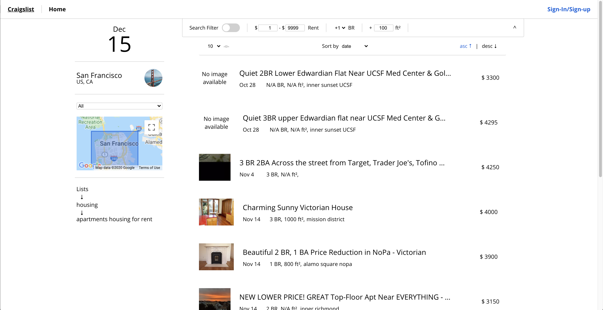
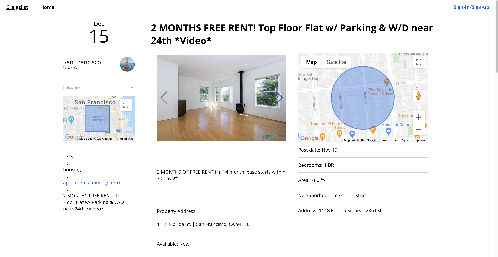
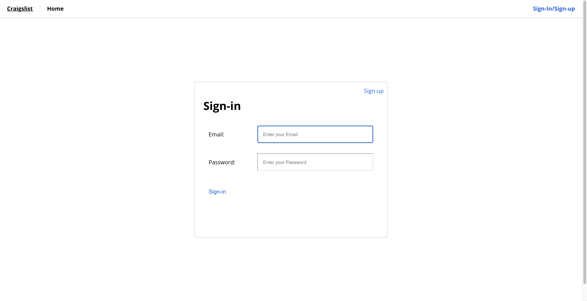
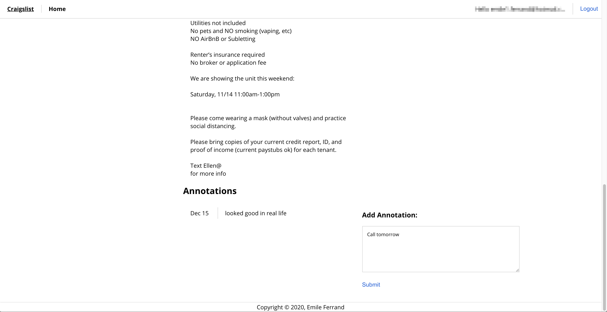
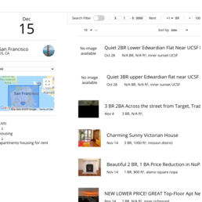

# craigslist-explorer

Final project for the class CS5610 Web Development

## Project description

OK, so for the final project we will go with an individual project that implements the full stack. It should include everything that we cover in class. To ease your burden of choosing I'm choosing for you the topic.
You will be building an application that let's me explore a list of Craigslist postings (I'll give you the file). The app should let me see the listings in an orderly manner, it should let users filter and sort by different criteria and registered users annotate the postings.
You must implement full authentication with passport or similar, and add a creative element of your choice. You must get that creative component approved by me on #project, there cannot be repeated creative components. If you need ideas DM me.
Deadline is the day of the final exam.

Class link: https://johnguerra.co/classes/webDevelopment_fall_2020/

Original dataset: [here](/data/apts.json)

## Author

Emile Ferrand

## Deployed application

Application is deployed on heroku: https://webdev-craigslist-exporer-back.herokuapp.com/

## Build instructions

1. Navigate to the root folder and do the following command `npm install`
2. To fully launch the application you will need a mongoDb with the following collections: `annotation`, `location`, `data`, `user`
3. Set the following ENV variables so the backend can functions property.
    - ENV (default value= localhost)
    - PORT (default value= 3000)  
    - URI (no default value)
4. to start the backend server run `npm run start:backend`
4. to start the frontend react application run `npm run start:frontend`

## Available scripts

- `npm run start`: Start de backend application on the server (command required for heroku)
- `npm run start:frontend`: Run frontend react application
- `npm run build`: Build frontend react application and move the build folder to the server folder
- `npm run start:backend`: Start the backend server
- `npm run clean-data`: clean json dataset,
- `npm run lint`: Run ESlint over all JS
- `npm run format`: Clean all js/html/css code by prettier standard

## Screenshots

### Home page

### Post page

### Sign-in/sign-up page

### Annotation

### Home page (small)

## License

> You can check out the full license [here](/LICENSE)

This project is licensed under the terms of the **MIT** license.

